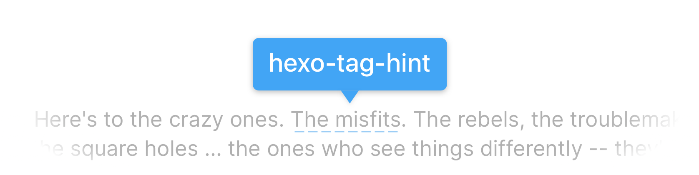
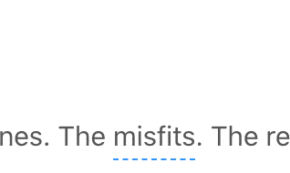
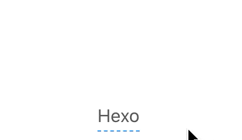

<p align="center">
  &nbsp;
  &nbsp;
  
</p>

`hexo-tag-hint` is a simplistic plugin for [Hexo](https://hexo.io) which presents a floating bubble containing the hint text when the content text gets *hovered* or *clicked* (yes, mobile-ready!).

## 💡 Basic Syntax

Insert this little [Nunjucks](https://github.com/mozilla/nunjucks) snippet anywhere you want to show your hints:

```js

```

Where `body_text` is the normal post body text, `hint_text` is the text that should be presented inside the hint bubble. Use `\'` to escape `'` if necessary.



E.g.:

```js

```

## 📖 Multi-line Support

Multi-line hints are supported right now🎉. Append additional hint text lines to build a multi-line hint:

```js

```



E.g.:

```js

```

## 🔌 Install & Update

Execute following one-liners to integrate this plugin into your Hexo project, or to update the plugin:

```bash
$ npm install hexo-tag-hint # install this plugin
$ npm update hexo-tag-hint # update the plugin
$ npm install hexo-tag-hint@latest # force update to latest version
```

## 🚀 Roadmap

- [x] Add support for multi-line hints
- [ ] Strip redundant style classes
- [ ] Make Color theme configurable

✏️*Open issues to request for more features!*

## 🙌 Special Thanks

Main feature of presenting hint bubble is heavily backed by [`hint.css`](https://github.com/chinchang/hint.css), an awesome CSS only tooltip library.

> Brought to you with ❤️ by E-Tiger Studio, 2017-2020. 
